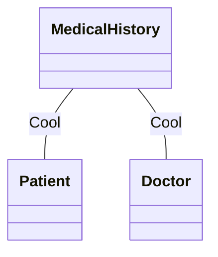
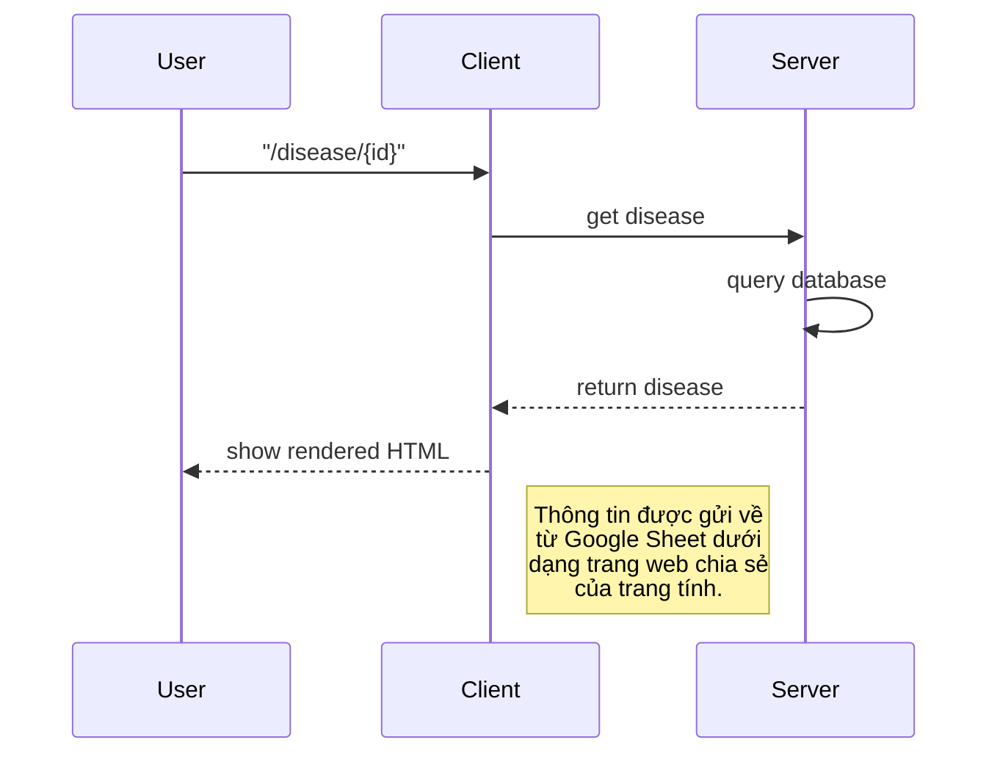
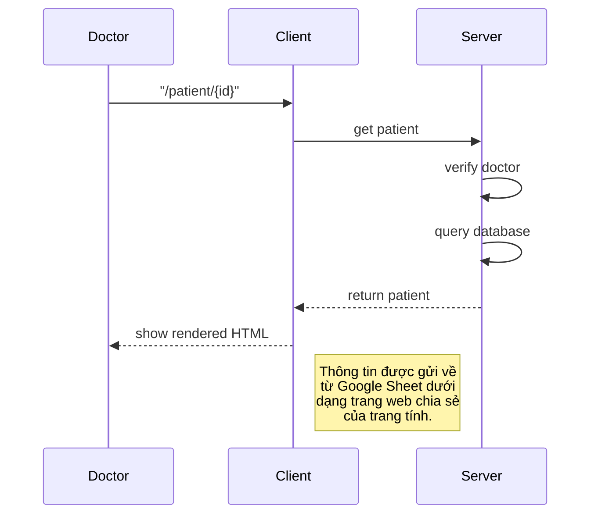
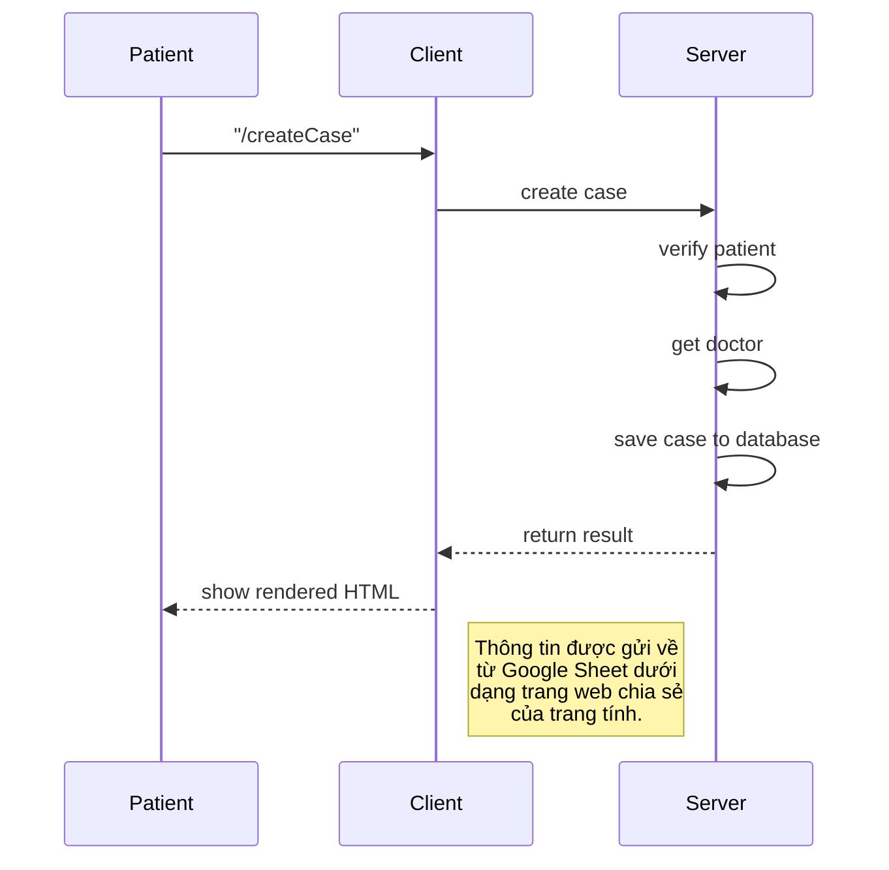

```mermaid
classDiagram
MedicalHistory -- Patient : Cool
MedicalHistory -- Doctor : Cool

```

```mermaid
sequenceDiagram
User ->> Client: "/disease/{id}"
Client ->> Server: get disease
Server ->> Server: query database
Server-->>Client: return disease
Client -->> User: show rendered HTML
Note right of Client: Thông tin được gửi về <br/> từ Google Sheet dưới <br/> dạng trang web chia sẻ <br/> của trang tính.
```

```mermaid
sequenceDiagram
Doctor ->> Client: "/patient/{id}"
Client ->> Server: get patient
Server ->> Server: verify doctor
Server ->> Server: query database
Server-->>Client: return patient
Client -->> Doctor: show rendered HTML
Note right of Client: Thông tin được gửi về <br/> từ Google Sheet dưới <br/> dạng trang web chia sẻ <br/> của trang tính.
```

```mermaid
sequenceDiagram
Patient ->> Client: "/doctor/{id}"
Client ->> Server: get doctor
Server ->> Server: verify patient
Server ->> Server: query database
Server-->>Client: return doctor
Client -->> Patient: show rendered HTML
Note right of Client: Thông tin được gửi về <br/> từ Google Sheet dưới <br/> dạng trang web chia sẻ <br/> của trang tính.
```

```mermaid
sequenceDiagram
Patient ->> Client: "/createCase"
Client ->> Server: create case
Server ->> Server: verify patient
Server ->> Server: get doctor
Server ->> Server: save case to database
Server-->>Client: return result
Client -->> Patient: show rendered HTML
Note right of Client: Thông tin được gửi về <br/> từ Google Sheet dưới <br/> dạng trang web chia sẻ <br/> của trang tính.
```

