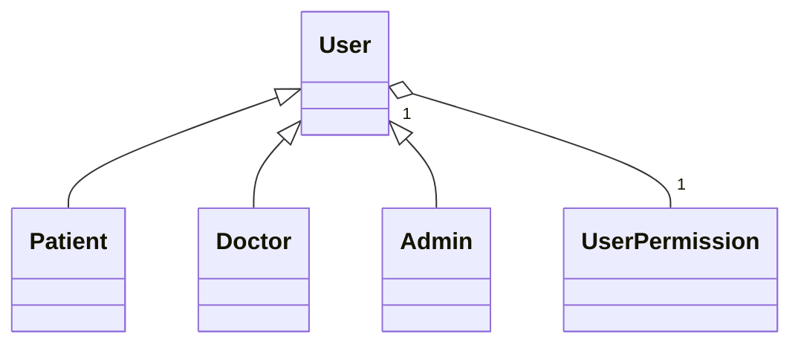
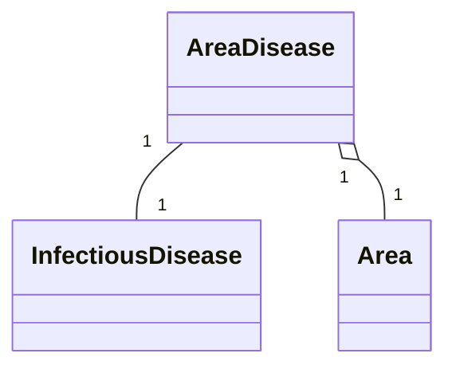
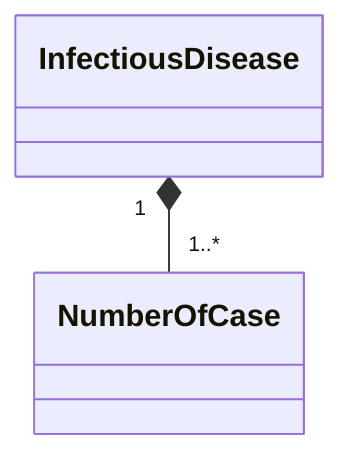
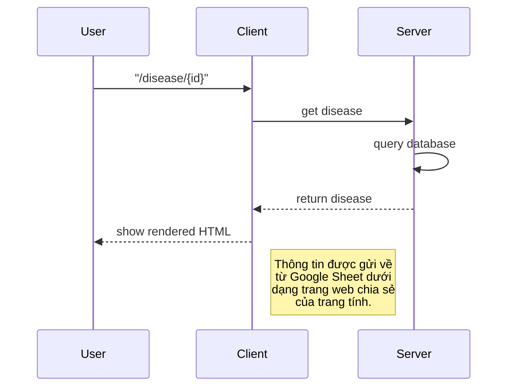
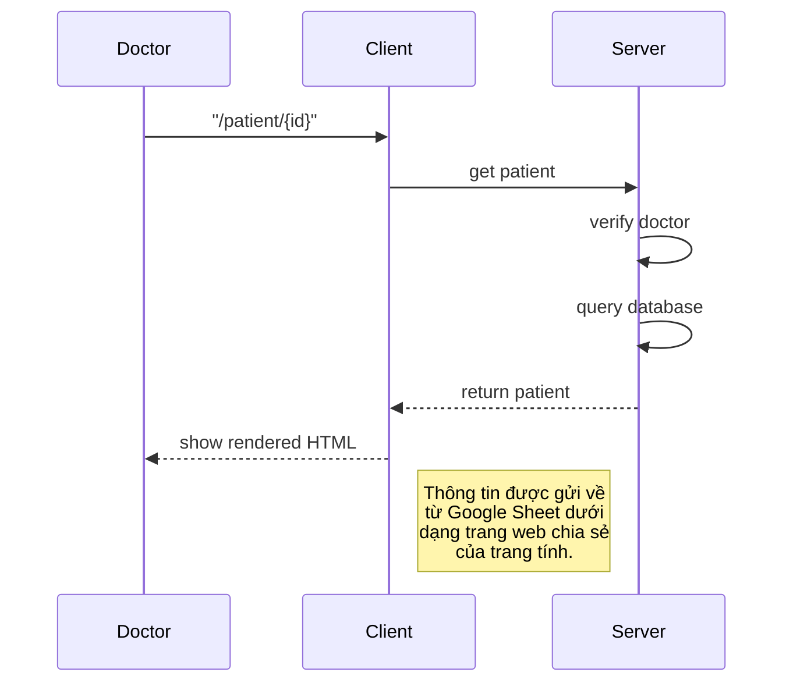
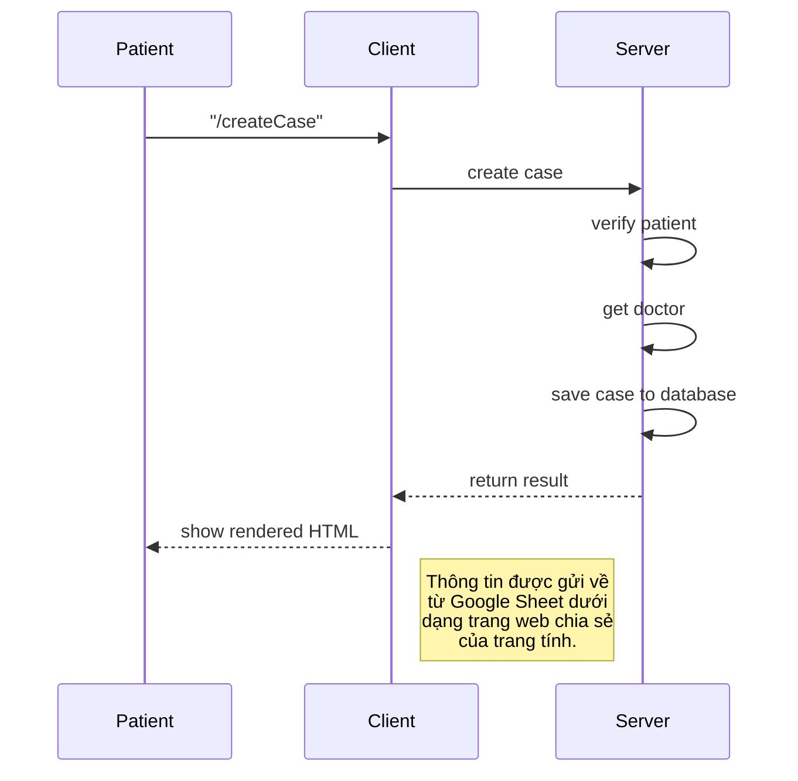

```mermaid
classDiagram
MedicalHistory "1..*" -- "1" Patient
MedicalHistory "1..*" -- "1" Doctor
MedicalHistory "1..*" -- "1..*" InfectiousDisease
MedicalHistory "1..*" -- "1..*" Drug
class MedicalHistory{
    int id
    List~string~ symptoms
    List~string~ advice
    Datetime date
    -setDoctor(Doctor~User~)
    -setPatient(Patient~User~)
    setAdvice(List~string~ advice)
    setSymptoms(List~string~ symptom)
    getMedicalHistory() MedicalHistory
}
class Patient~User~{
    int id
    List~string~ name
    createMedicalHistory()
    setName(List~string~ name)
    getName() List~string~ name
}
class Doctor~User~{
    int id
    List~string~ name
    List~string~ affiliate
    answerMedicalHistory()
    setName(List~string~ name)
    getName() List~string~ name
    setAffiliate(List~string~ affiliate)
    getAffiliate() List~string~ affiliate
}
class InfectiousDisease {
    int id
    List~string~ label
    List~string~ name
    List~string~ symptom
    List~string~ effect
    List~string~ prevention
    List~string~ information
    getInfectiousDisease() InfectiousDisease
}
class Drug {
    int id
    List~string~ name
    List~string~ vendor
    List~string~ product_id
    Image drug_image
    List~string~ ingredents
    getDrug() Drug
}
```

```mermaid
classDiagram
User <|-- Patient
User <|-- Doctor
User <|-- Admin
User "1" o-- "1" UserPermission
```

```mermaid
classDiagram
AreaDisease "1" -- "1" InfectiousDisease
AreaDisease "1" o-- "1" Area
```

```mermaid
classDiagram
InfectiousDisease "1" *-- "1..*" NumberOfCase
```

```mermaid
sequenceDiagram
User ->> Client: "/disease/{id}"
Client ->> Server: get disease
Server ->> Server: query database
Server-->>Client: return disease
Client -->> User: show rendered HTML
Note right of Client: Thông tin được gửi về <br/> từ Google Sheet dưới <br/> dạng trang web chia sẻ <br/> của trang tính.
```

```mermaid
sequenceDiagram
Doctor ->> Client: "/patient/{id}"
Client ->> Server: get patient
Server ->> Server: verify doctor
Server ->> Server: query database
Server-->>Client: return patient
Client -->> Doctor: show rendered HTML
Note right of Client: Thông tin được gửi về <br/> từ Google Sheet dưới <br/> dạng trang web chia sẻ <br/> của trang tính.
```

```mermaid
sequenceDiagram
Patient ->> Client: "/doctor/{id}"
Client ->> Server: get doctor
Server ->> Server: verify patient
Server ->> Server: query database
Server-->>Client: return doctor
Client -->> Patient: show rendered HTML
Note right of Client: Thông tin được gửi về <br/> từ Google Sheet dưới <br/> dạng trang web chia sẻ <br/> của trang tính.
```

```mermaid
sequenceDiagram
Patient ->> Client: "/createCase"
Client ->> Server: create case
Server ->> Server: verify patient
Server ->> Server: get doctor
Server ->> Server: save case to database
Server-->>Client: return result
Client -->> Patient: show rendered HTML
Note right of Client: Thông tin được gửi về <br/> từ Google Sheet dưới <br/> dạng trang web chia sẻ <br/> của trang tính.
```

