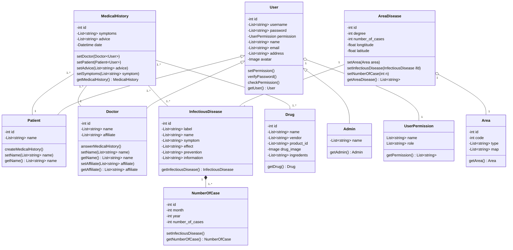
```mermaid
classDiagram
MedicalHistory "1..*" -- "1" Patient
MedicalHistory "1..*" -- "1" Doctor
MedicalHistory "1..*" -- "1..*" InfectiousDisease
MedicalHistory "1..*" -- "1..*" Drug
User <|-- Patient
User <|-- Doctor
User <|-- Admin
User "1" o-- "1" UserPermission
class MedicalHistory{
    -int id
    -List~string~ symptoms
    -List~string~ advice
    -Datetime date
    setDoctor(Doctor~User~)
    setPatient(Patient~User~)
    setAdvice(List~string~ advice)
    setSymptoms(List~string~ symptom)
    getMedicalHistory() MedicalHistory
}
class Patient~User~{
    -int id
    -List~string~ name
    createMedicalHistory()
    setName(List~string~ name)
    getName() List~string~ name
}
class Doctor~User~{
    -int id
    -List~string~ name
    -List~string~ affiliate
    answerMedicalHistory()
    setName(List~string~ name)
    getName() List~string~ name
    setAffiliate(List~string~ affiliate)
    getAffiliate() List~string~ affiliate
}
class InfectiousDisease {
    -int id
    -List~string~ label
    -List~string~ name
    -List~string~ symptom
    -List~string~ effect
    -List~string~ prevention
    -List~string~ information
    getInfectiousDisease() InfectiousDisease
}
class Drug {
    -int id
    -List~string~ name
    -List~string~ vendor
    -List~string~ product_id
    -Image drug_image
    -List~string~ ingredents
    getDrug() Drug
}
class User {
    -int id
    -List~string~ username
    -List~string~ password
    -UserPermission permission
    -List~string~ name
    -List~string~ email
    -List~string~ address
    -Image avatar
    setPermission()
    verifyPassword()
    checkPermission()
    getUser() User
}
class Admin~User~ {
    -List~string~ name
    getAdmin() Admin
}
class UserPermission {
    List~string~ name
    List~string~ role
    getPermission() List~string~
}
AreaDisease "1" -- "1" InfectiousDisease
AreaDisease "1" o-- "1" Area
class AreaDisease {
    -int id
    -int degree
    -int number_of_cases
    -float longtitude
    -float latitude
    setArea(Area area)
    setInfectiousDisease(InfectiousDisease ifd)
    setNumberOfCase(int n)
    getAreaDisease() List~string~
}
class Area {
    -int id
    -int code
    -List~string~ type
    -List~string~ map
    getArea() Area
}
InfectiousDisease "1" *-- "1..*" NumberOfCase
class NumberOfCase {
    -int id
    -int month
    -int year
    -int number_of_cases
    setInfectiousDisease()
    getNumberOfCase() NumberOfCase
}
```

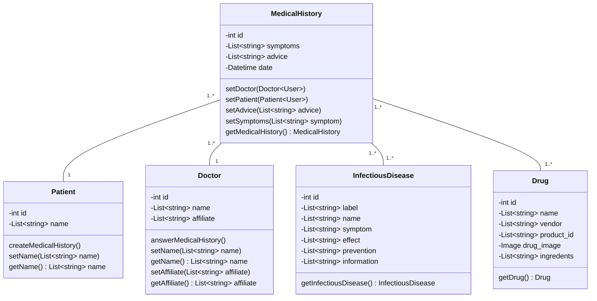
```mermaid
classDiagram
MedicalHistory "1..*" -- "1" Patient
MedicalHistory "1..*" -- "1" Doctor
MedicalHistory "1..*" -- "1..*" InfectiousDisease
MedicalHistory "1..*" -- "1..*" Drug
class MedicalHistory{
    -int id
    -List~string~ symptoms
    -List~string~ advice
    -Datetime date
    setDoctor(Doctor~User~)
    setPatient(Patient~User~)
    setAdvice(List~string~ advice)
    setSymptoms(List~string~ symptom)
    getMedicalHistory() MedicalHistory
}
class Patient~User~{
    -int id
    -List~string~ name
    createMedicalHistory()
    setName(List~string~ name)
    getName() List~string~ name
}
class Doctor~User~{
    -int id
    -List~string~ name
    -List~string~ affiliate
    answerMedicalHistory()
    setName(List~string~ name)
    getName() List~string~ name
    setAffiliate(List~string~ affiliate)
    getAffiliate() List~string~ affiliate
}
class InfectiousDisease {
    -int id
    -List~string~ label
    -List~string~ name
    -List~string~ symptom
    -List~string~ effect
    -List~string~ prevention
    -List~string~ information
    getInfectiousDisease() InfectiousDisease
}
class Drug {
    -int id
    -List~string~ name
    -List~string~ vendor
    -List~string~ product_id
    -Image drug_image
    -List~string~ ingredents
    getDrug() Drug
}
```

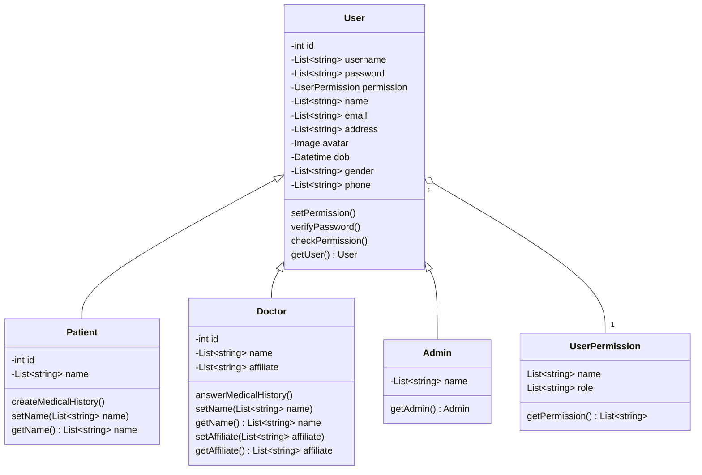
```mermaid
classDiagram
User <|-- Patient
User <|-- Doctor
User <|-- Admin
User "1" o-- "1" UserPermission
class User {
    -int id
    -List~string~ username
    -List~string~ password
    -UserPermission permission
    -List~string~ name
    -List~string~ email
    -List~string~ address
    -Image avatar
    -Datetime dob
    -List~string~ gender
    -List~string~ phone
    setPermission()
    verifyPassword()
    checkPermission()
    getUser() User
}
class Admin~User~ {
    -List~string~ name
    getAdmin() Admin
}
class UserPermission {
    List~string~ name
    List~string~ role
    getPermission() List~string~
}
class Patient~User~{
    -int id
    -List~string~ name
    createMedicalHistory()
    setName(List~string~ name)
    getName() List~string~ name
}
class Doctor~User~{
    -int id
    -List~string~ name
    -List~string~ affiliate
    answerMedicalHistory()
    setName(List~string~ name)
    getName() List~string~ name
    setAffiliate(List~string~ affiliate)
    getAffiliate() List~string~ affiliate
}
```

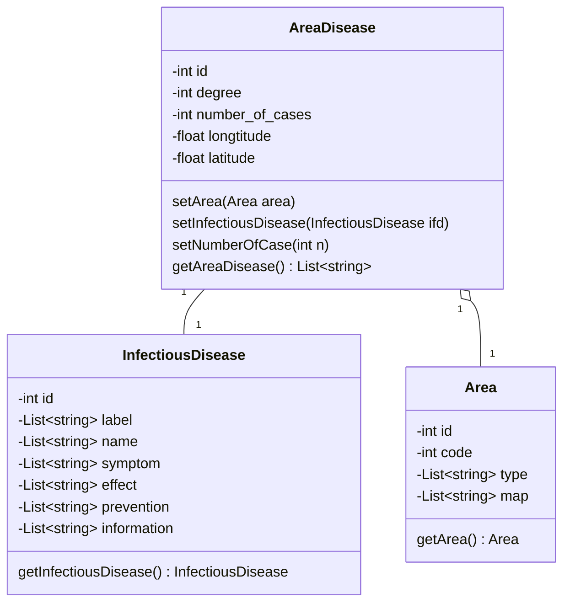
```mermaid
classDiagram
AreaDisease "1" -- "1" InfectiousDisease
AreaDisease "1" o-- "1" Area
class AreaDisease {
    -int id
    -int degree
    -int number_of_cases
    -float longtitude
    -float latitude
    setArea(Area area)
    setInfectiousDisease(InfectiousDisease ifd)
    setNumberOfCase(int n)
    getAreaDisease() List~string~
}
class Area {
    -int id
    -int code
    -List~string~ type
    -List~string~ map
    getArea() Area
}
class InfectiousDisease {
    -int id
    -List~string~ label
    -List~string~ name
    -List~string~ symptom
    -List~string~ effect
    -List~string~ prevention
    -List~string~ information
    getInfectiousDisease() InfectiousDisease
}
```

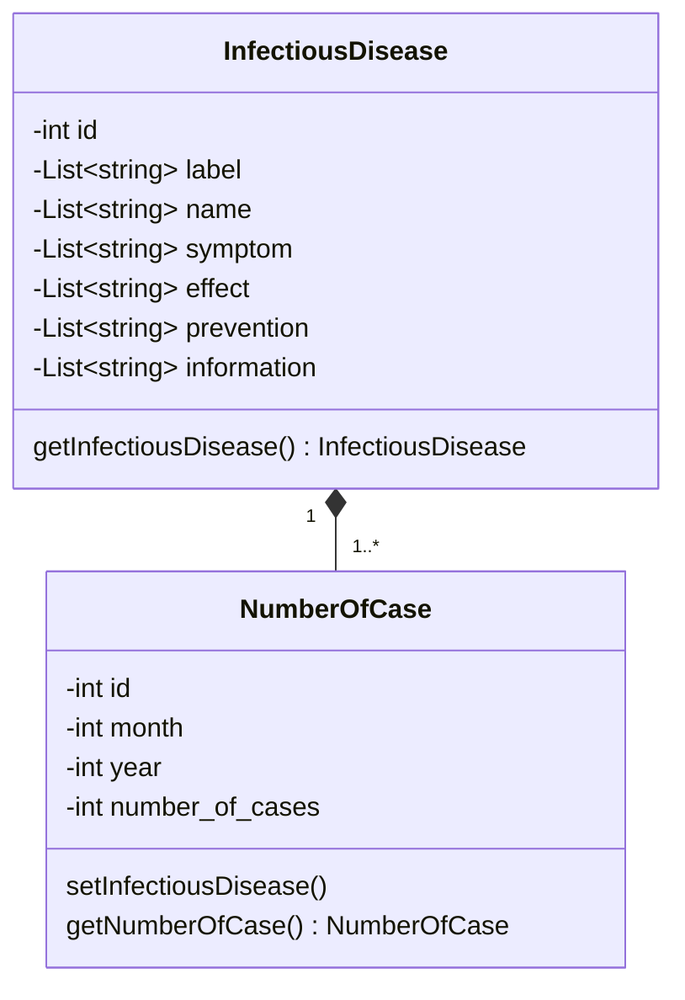
```mermaid
classDiagram
InfectiousDisease "1" *-- "1..*" NumberOfCase
class InfectiousDisease {
    -int id
    -List~string~ label
    -List~string~ name
    -List~string~ symptom
    -List~string~ effect
    -List~string~ prevention
    -List~string~ information
    getInfectiousDisease() InfectiousDisease
}
class NumberOfCase {
    -int id
    -int month
    -int year
    -int number_of_cases
    setInfectiousDisease()
    getNumberOfCase() NumberOfCase
}
```

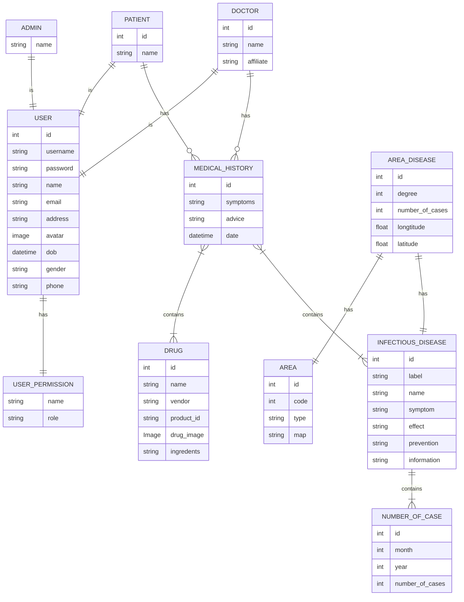
```mermaid
erDiagram
    DOCTOR ||--o{ MEDICAL_HISTORY: has
    PATIENT ||--o{ MEDICAL_HISTORY: has
    MEDICAL_HISTORY }|--|{ INFECTIOUS_DISEASE: contains
    MEDICAL_HISTORY }|--|{ DRUG: contains
    PATIENT ||--|| USER: is
    DOCTOR ||--|| USER: is
    ADMIN ||--|| USER: is
    USER ||--|| USER_PERMISSION: has
    AREA_DISEASE ||--|| INFECTIOUS_DISEASE: has
    AREA_DISEASE ||--|| AREA: has
    INFECTIOUS_DISEASE ||--|{ NUMBER_OF_CASE: contains
    NUMBER_OF_CASE {
        int id
        int month
        int year
        int number_of_cases
    }
    AREA_DISEASE {
        int id
        int degree
        int number_of_cases
        float longtitude
        float latitude
    }
    AREA {
        int id
        int code
        string type
        string map
    }
    USER {
        int id
        string username
        string password
        string name
        string email
        string address
        image avatar
        datetime dob
        string gender
        string phone
    }
    ADMIN {
        string name
    }
    USER_PERMISSION {
        string name
        string role
    }
    MEDICAL_HISTORY {
        int id
        string symptoms
        string advice
        datetime date
    }
    DOCTOR {
        int id
        string name
        string affiliate
    }
    PATIENT {
        int id
        string name
    }
    INFECTIOUS_DISEASE {
        int id
        string label
        string name
        string symptom
        string effect
        string prevention
        string information
    }
    DRUG {
        int id
        string name
        string vendor
        string product_id
        Image drug_image
        string ingredents
    }
```

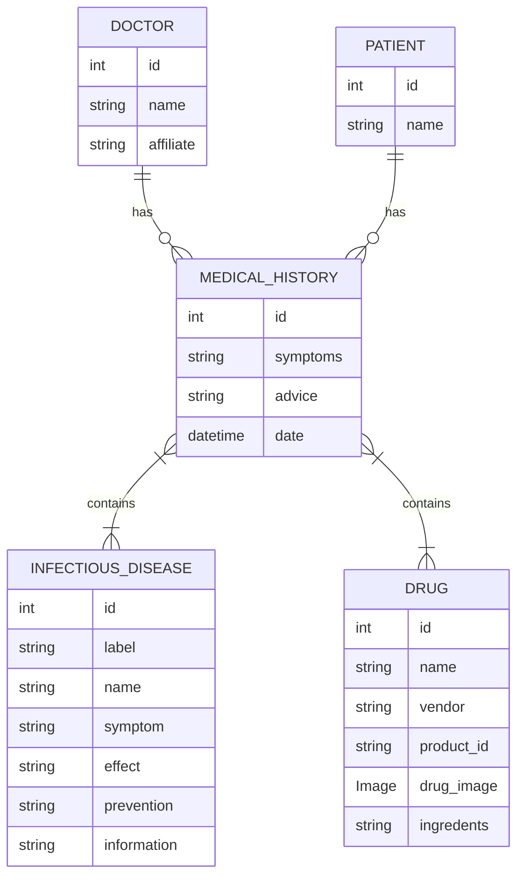
```mermaid
erDiagram
    DOCTOR ||--o{ MEDICAL_HISTORY: has
    PATIENT ||--o{ MEDICAL_HISTORY: has
    MEDICAL_HISTORY }|--|{ INFECTIOUS_DISEASE: contains
    MEDICAL_HISTORY }|--|{ DRUG: contains
    MEDICAL_HISTORY {
        int id
        string symptoms
        string advice
        datetime date
    }
    DOCTOR {
        int id
        string name
        string affiliate
    }
    PATIENT {
        int id
        string name
    }
    INFECTIOUS_DISEASE {
        int id
        string label
        string name
        string symptom
        string effect
        string prevention
        string information
    }
    DRUG {
        int id
        string name
        string vendor
        string product_id
        Image drug_image
        string ingredents
    }
```

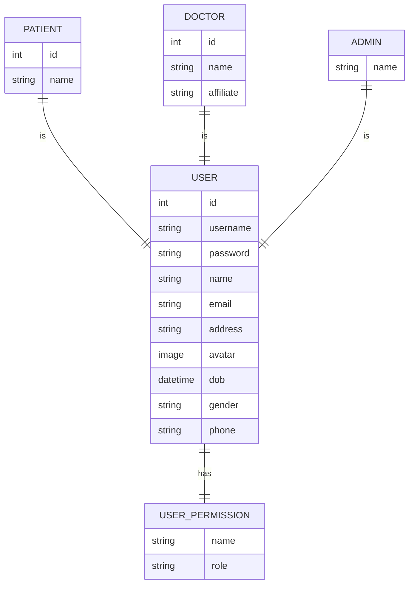
```mermaid
erDiagram
PATIENT ||--|| USER: is
DOCTOR ||--|| USER: is
ADMIN ||--|| USER: is
USER ||--|| USER_PERMISSION: has
    USER {
        int id
        string username
        string password
        string name
        string email
        string address
        image avatar
        datetime dob
        string gender
        string phone
    }
    ADMIN {
        string name
    }
    USER_PERMISSION {
        string name
        string role
    }
    DOCTOR {
        int id
        string name
        string affiliate
    }
    PATIENT {
        int id
        string name
    }
```

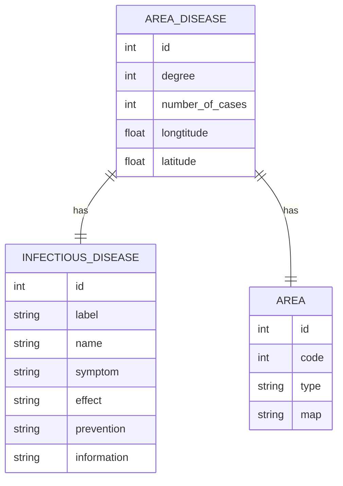
```mermaid
erDiagram
AREA_DISEASE ||--|| INFECTIOUS_DISEASE: has
AREA_DISEASE ||--|| AREA: has
    AREA_DISEASE {
        int id
        int degree
        int number_of_cases
        float longtitude
        float latitude
    }
    AREA {
        int id
        int code
        string type
        string map
    }
    INFECTIOUS_DISEASE {
        int id
        string label
        string name
        string symptom
        string effect
        string prevention
        string information
    }
```

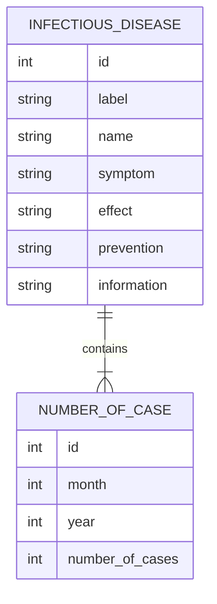
```mermaid
erDiagram
INFECTIOUS_DISEASE ||--|{ NUMBER_OF_CASE: contains
    INFECTIOUS_DISEASE {
        int id
        string label
        string name
        string symptom
        string effect
        string prevention
        string information
    }
    NUMBER_OF_CASE {
        int id
        int month
        int year
        int number_of_cases
    }
```

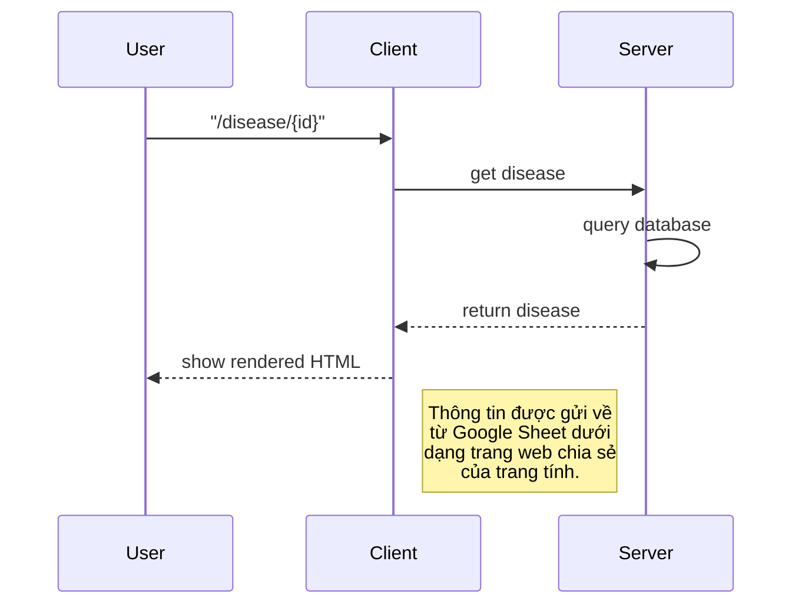
```mermaid
sequenceDiagram
User ->> Client: "/disease/{id}"
Client ->> Server: get disease
Server ->> Server: query database
Server-->>Client: return disease
Client -->> User: show rendered HTML
Note right of Client: Thông tin được gửi về <br/> từ Google Sheet dưới <br/> dạng trang web chia sẻ <br/> của trang tính.
```

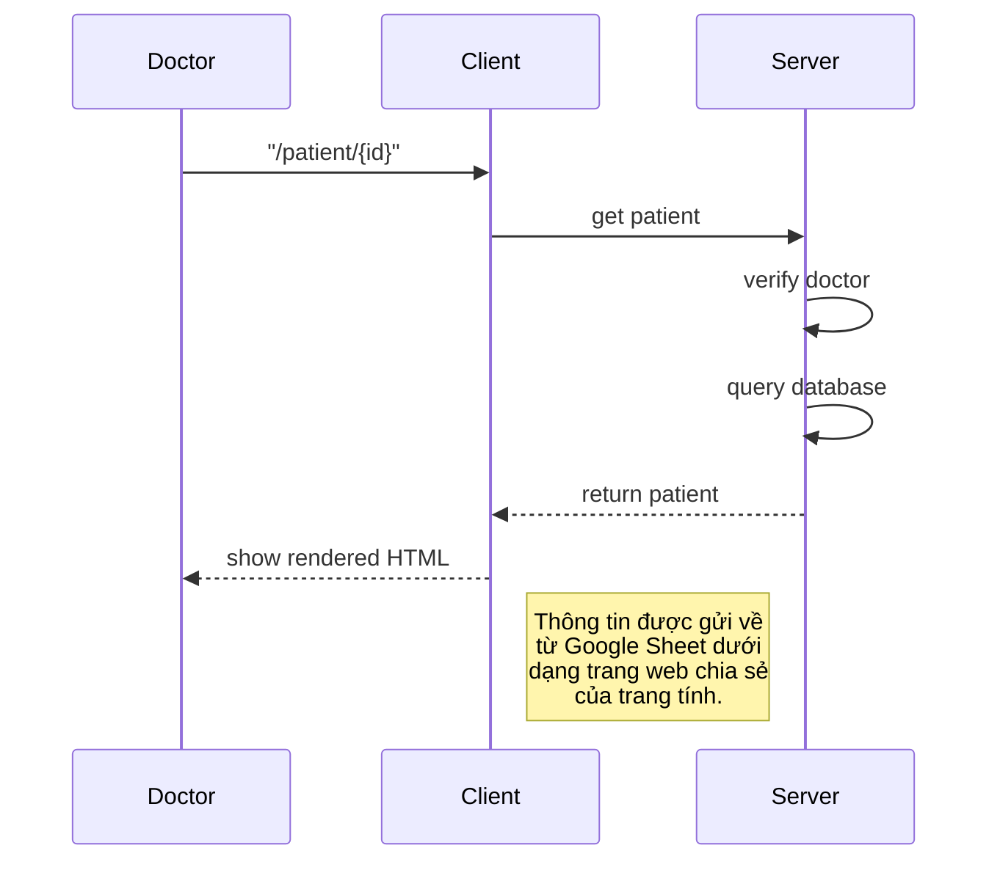
```mermaid
sequenceDiagram
Doctor ->> Client: "/patient/{id}"
Client ->> Server: get patient
Server ->> Server: verify doctor
Server ->> Server: query database
Server-->>Client: return patient
Client -->> Doctor: show rendered HTML
Note right of Client: Thông tin được gửi về <br/> từ Google Sheet dưới <br/> dạng trang web chia sẻ <br/> của trang tính.
```

```mermaid
sequenceDiagram
Patient ->> Client: "/doctor/{id}"
Client ->> Server: get doctor
Server ->> Server: verify patient
Server ->> Server: query database
Server-->>Client: return doctor
Client -->> Patient: show rendered HTML
Note right of Client: Thông tin được gửi về <br/> từ Google Sheet dưới <br/> dạng trang web chia sẻ <br/> của trang tính.
```

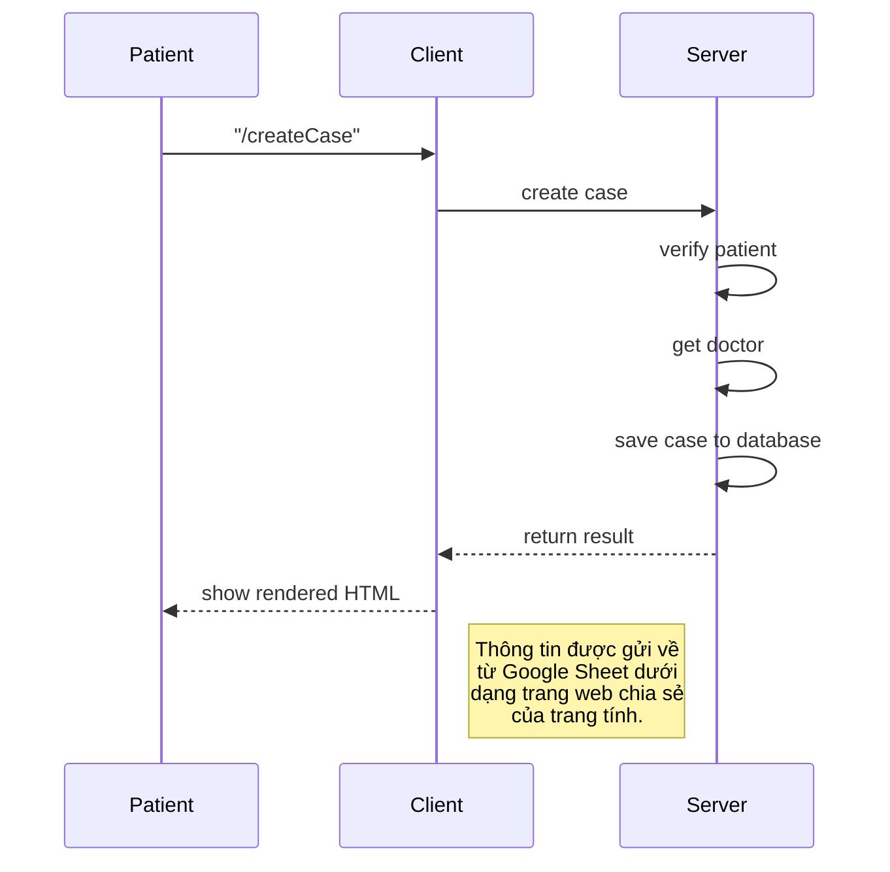
```mermaid
sequenceDiagram
Patient ->> Client: "/createCase"
Client ->> Server: create case
Server ->> Server: verify patient
Server ->> Server: get doctor
Server ->> Server: save case to database
Server-->>Client: return result
Client -->> Patient: show rendered HTML
Note right of Client: Thông tin được gửi về <br/> từ Google Sheet dưới <br/> dạng trang web chia sẻ <br/> của trang tính.
```

