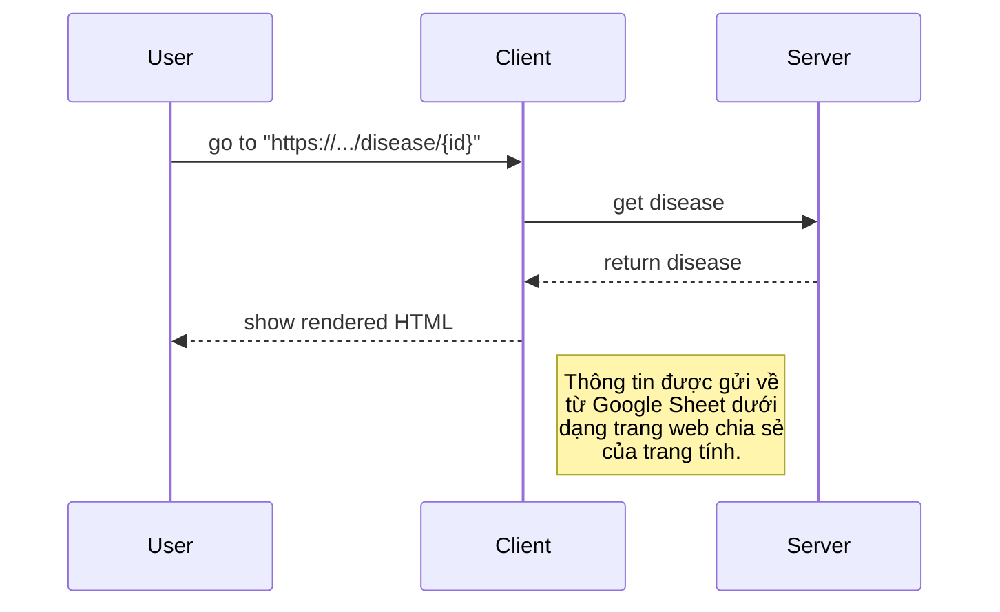
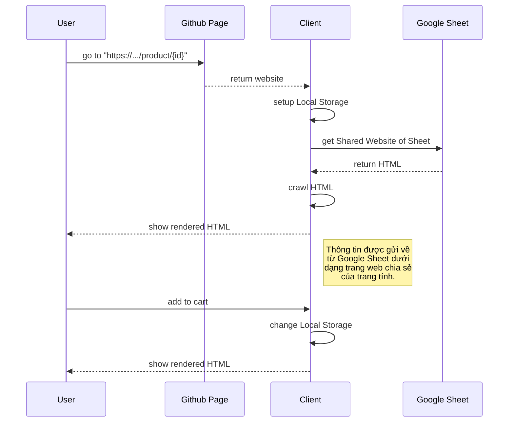

```mermaid
sequenceDiagram
User ->> Client: go to "https://.../disease/{id}"
Client ->> Server: get disease
Server-->>Client: return disease
Client -->> User: show rendered HTML
Note right of Client: Thông tin được gửi về <br/> từ Google Sheet dưới <br/> dạng trang web chia sẻ <br/> của trang tính.
```

```mermaid
sequenceDiagram
User ->> Github Page: go to "https://.../product/{id}"
Github Page -->> Client: return website
Client ->> Client: setup Local Storage
Client ->> Google Sheet: get Shared Website of Sheet
Google Sheet-->>Client: return HTML
Client ->> Client: crawl HTML
Client -->> User: show rendered HTML
Note right of Client: Thông tin được gửi về <br/> từ Google Sheet dưới <br/> dạng trang web chia sẻ <br/> của trang tính.
User ->> Client: add to cart
Client ->> Client: change Local Storage
Client -->> User: show rendered HTML
```

